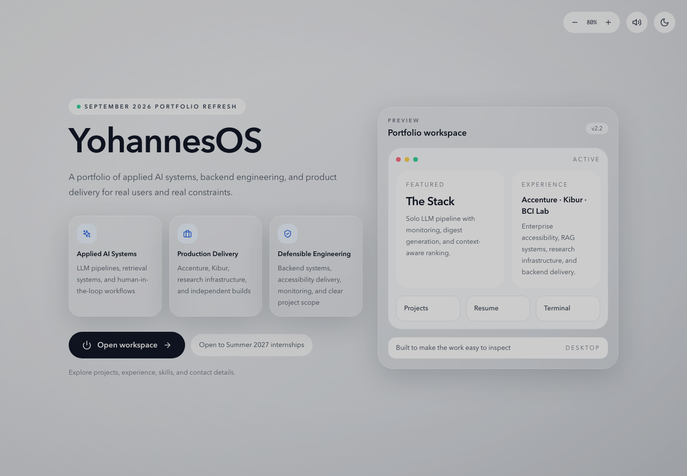
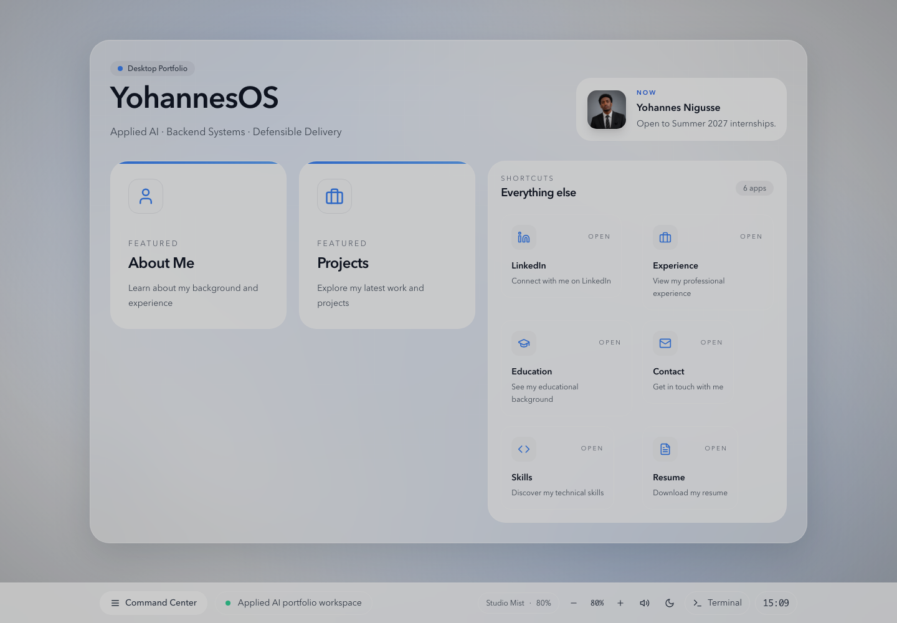
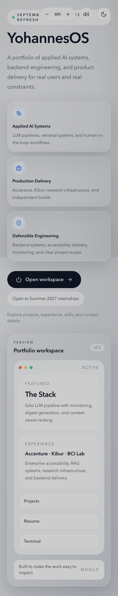
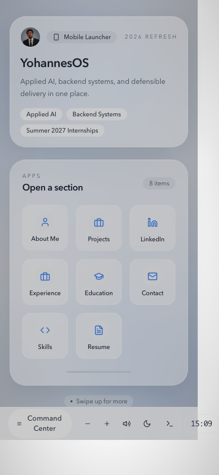

# YohannesOS

[YohannesOS](https://yohanes-os.vercel.app/) is an interactive portfolio workspace for Yohannes Nigusse. It presents applied AI systems, backend engineering, professional experience, and selected product work through a desktop and mobile OS-inspired interface.

**Built with:** React, TypeScript, Vite, Tailwind CSS, and a typed portfolio data model.

## Showcase

### Desktop

| Landing | Workspace |
| --- | --- |
|  |  |

### Mobile

| Landing | Workspace |
| --- | --- |
|  |  |

## What It Includes

- Desktop and phone-first portfolio launchers with distinct interaction models.
- Project, experience, education, skills, contact, and resume surfaces.
- A terminal mode for browsing the same portfolio data from a command-line interface.
- A single content model that keeps portfolio views and resume material aligned.

## Development

```bash
cd project
npm install
npm run dev
```

Run `npm run build` for a production build. Use `npm run build:resume` to regenerate the public resume PDF.
