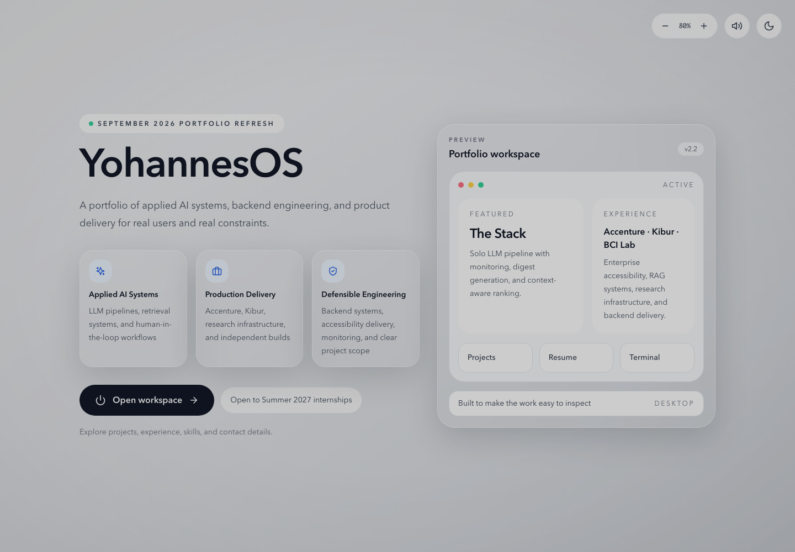
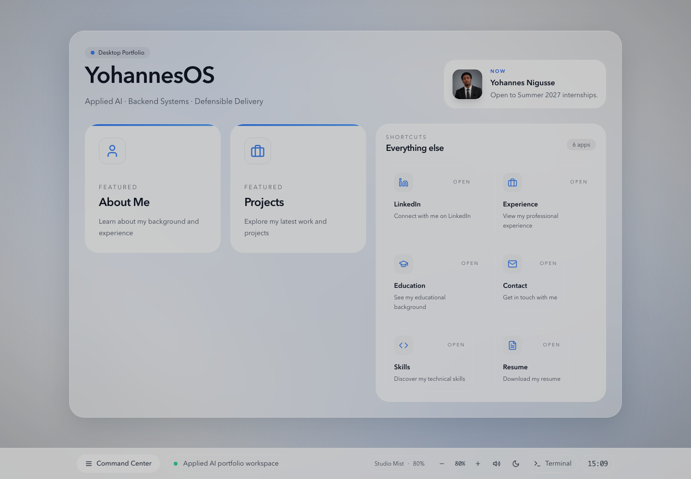
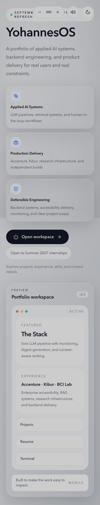
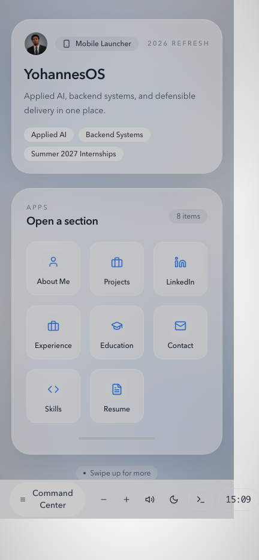

# YohannesOS

[YohannesOS](https://yohanes-os.vercel.app/) is an OS-inspired portfolio for Yohannes Nigusse, built with React, TypeScript, Tailwind CSS, and Vite. Includes a Power On landing screen, desktop app launcher, interactive terminal, taskbar, and portfolio sections.

Yohannes builds backend systems, full-stack products, and applied AI workflows. He completed Accenture's Technology Summer Analyst internship in August 2026 and serves as Vice President of NSBE. B.S. Computer Science (AI/ML Track), St. Cloud State University; GPA 3.92; expected graduation December 2027.

## Showcase

These screenshots document the previous UI design; the current site restores the simpler Power On landing screen and app grid.

### Desktop

| Landing | Workspace |
| --- | --- |
|  |  |

### Mobile

| Landing | Workspace |
| --- | --- |
|  |  |

## What It Includes

- Desktop and phone-first portfolio launchers with distinct interaction models.
- Project, experience, education, skills, contact, and resume surfaces.
- A terminal mode for browsing the same portfolio data from a command-line interface.
- Shared portfolio data for the desktop sections and terminal, with supplied resume PDFs available for download.

## Run locally

Install Node.js and npm, then run from the repository root:

```bash
cd project
npm ci
npm run dev -- --host localhost
```

Open the local URL printed by Vite, usually http://localhost:5173.

## Build and checks

Run these commands from `project/`:

```bash
npm run build
npm run lint
npm run preview
```

The production build is written to `project/dist/`. The standalone TypeScript check (`npx tsc --noEmit -p tsconfig.app.json`) currently reports existing UI typing issues.

## Project structure

- `project/src/components/` — landing screen, desktop, modals, terminal, and menus.
- `project/src/data/portfolioData.ts` — portfolio content shared by the UI and terminal.
- `project/public/` — committed resumes, photos, and favicons copied into production builds.

Projects begin with The Stack and RidgeRunner, followed by NimbusQueue and CampusMarket. Additional projects cover database concurrency, inventory management, retrieval, and other software work.

The default resume is `project/public/Yohannes_Nigusse_Product_Software_Resume.pdf`. Backend and enterprise resume alternatives are also available. `resume.pdf` and the older named resume URL are compatibility copies of the Product Software resume. Update those copies together when replacing the default resume.

Local editor settings, agent configuration, CodeGraph indexes, dependencies, and build output are ignored by Git.

## Contact

[yohanigusse@gmail.com](mailto:yohanigusse@gmail.com) · [LinkedIn](https://www.linkedin.com/in/yohs) · [GitHub](https://github.com/Yohanes-Mk)
